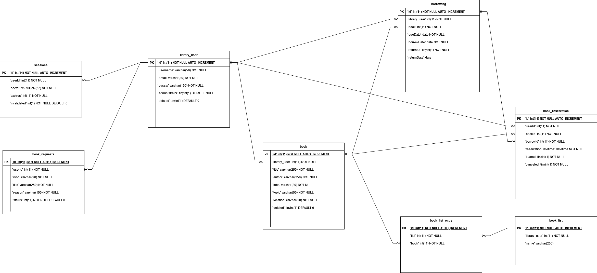

# library-project-backend

## Installing the project

You need to have npm installed to run this project, you can check if you have it installed by running `npm -v` in the command line.

Clone the repository on your computer. Detailed instructions can be found [here](https://docs.github.com/en/repositories/creating-and-managing-repositories/cloning-a-repository?tool=webui).

## Environment variables

Database connection doesn't work without **.env** in **root** folder. .env is set to be ignored by git with .gitignore, so create one locally. You will not need this if you're using docker-compose. By default the backend server will start on port 3000, which can be changed by setting `PORT` environment variable.

Here's an example of a .env file you can use:

```env
    DATABASE_SERVER=localhost
    DATABASE_NAME=efilibrarydb
    DATABASE_USER=root
    DATABASE_PASSWORD=admin <<< This should be whatever your root password is
    PORT=3002
```

# How to run

You will need to run the backend application and the database. You can have them separately, or you can use docker-compose.

## Using docker-compose

Database initialization is handled automatically on creation using the _\*.sql_ files in the [/sql](./sql/) folder. [docker-compose-test.yml](docker-compose-test.yml) also contains the database credentials for local development as environment variables. These must only be used for local development.

If you have Windows, make you have Docker Desktop running before running the command.

```
docker-compose -f docker-compose-test.yml up -d
```

The -f flag specifies the file since there are different ones. The -d flag (detach) runs the container in the background allowing you to close the terminal without killing the process.

## Creating the database separately

Having the database and the node project separately is more convenient if you want to make changes to the code.

### Setting up the local database

You can use Docker to create the MariaDB container:

```cmd
docker run -d --name efilibrary-mariadb -p "3306:3306" --env MARIADB_ROOT_PASSWORD=admin --volume efilbirary-mariadb-data:/var/lib/mysql mariadb:latest
```

Each time you start up the project, you can just start the existing container, you don't have to create a new database every time.

Once you have the database up and running, you need to execute the scripts in the [/sql](./sql/) folder. [Here's a video](https://youtu.be/POcHaIwmAhw) on how to do it in MySQL Workbench, but you can also use DataGrip or another database explorer.

### Running the node project

Use `npm ci` or `npm install` to install node modules.

Start the backend by running `npm start`.

## What the previous team used:

To make SQL queries from backend, a local database isn't necessary: the backend can access remote database via PuTTY and tunneling. <br> To set up tunneling in PuTTY, have _Host Name_ set as **javaohjelmointi.net** and _Port_ as **22**. Under _Connection-> SSH -> Tunnels_, set _Source port_ as **3306** and _Destination_ as **localhost:3306**. After that, select _Session_ again, name the session under _Saved Session_, save it, select it from the list, and press **Open**. <br>
After connecting, input proper credentials from **#secrets**. The database is then available on localhost:3306.

### Using DevContainers

> Note: These files have not been used or updated in a while so it's possible that this does not work.

The [.devcontainer](.devcontainer/) folder contains files for developing the backend in a [VS Code Container](https://code.visualstudio.com/docs/remote/containers). See installation and usage instructions at [code.visualstudio.com](https://code.visualstudio.com/docs/remote/containers).

<br>

# Workflows

There are two workflows files that run on this repository: [node.js.yml](/.github/workflows/node.js.yml) and [deploy-staging.yml](/.github/workflows/deploy-staging.yml).

The Node.js CI workflow is designed to ensure code quality and functionality before changes are merged. It triggers on every push or when a pull request is made to `development`, `main`, or `s23-staging` branches. Here's a step-by-step breakdown of the workflow:

1. **Code Formatting Check**: Utilizes Prettier to ensure code is following the project's formatting standards.
2. **Backend Spin-up**: Initiates the backend and employs `wait-on` to verify when the URL is available. A timeout here often indicates an issue with container/app build.
3. **Robot Tests**: Executes robot tests to verify code functionality. If tests fail, review and update your code or the tests accordingly.

## The Prettier workflow

The Prettier workflow is setup in the code with Pretty-quick (https://github.com/azz/pretty-quick) and Husky (https://typicode.github.io/husky/) to ensure consistent formatting. Pretty-Quick checks formatting when a developer tries to commit to the repo, and fixes formatting using our prettier config (.prettierrc.json file in the root of the project). Husky ensures that the pre-commit checks works with a pre-commit hook. Make sure you have all dependencies installed by running: `npm install` before you start. In your code editor, you can also set prettier checks on save, which will help the process.

# Endpoints

### Note #4:

Endpoints that use body will be in JSON format. Endpoint requires either query or body, if query is present, the body section will not be shown and vice versa.
<br>

[Postman files](https://github.com/LibraryProjectGroup/library-project-backend/tree/s23-refactor/docs/postman)

If not separately mentioned, On Success Response schema is:

```JSON
{
  "ok": true
}
```

If not separately mentioned, On Fail Response schema is:

```JSON
{
  "ok": fail
}
```

## Auth

<Details>
    <Summary>
        Show Endpoints
    </Summary>

### /auth/register (POST)

Body

```JSON
{
  "username": string,
  "email": string,
  "password": string
}
```

On Success Response schema:

```JSON
{
  "ok": true,
  "secret": string
}
```

On Fail Response schema:

```JSON
{
  "ok": false,
  "message": string
}
```

### /auth/login (POST)

Body

```JSON
{
  "email": string,
  "password": string
}
```

On Success Response schema:

```JSON
{
  "ok": true,
  "userId": number,
  "secret": string
}
```

On Fail Response schema:

```JSON
{
  "ok": false,
  "message": string
}
```

### /auth/logout (POST)

On Fail Response schema:

```JSON
{
  "ok": false,
  "message": string
}
```

</Details>

## Book List Entry

<Details>
    <Summary>
        Show Endpoints
    </Summary>
    
### /booklistentry/all (GET)
On Success Response schema:
```JSON
[
  {
    "id": number,
    "list": number,
    "book": number
  }
]
```

On Fail Response schema:

```JSON
{
  "ok": false,
  "status": 500
}
```

### /booklistentry/list?id={id} (GET)

On Success Response schema:

```JSON
[
  {
    "id": number,
    "list": number,
    "book": number
  }
]
```

On Fail Response schema:

```JSON
{
  "ok": false,
  "status": 500
}
```

### /booklistentry?id={id} (GET)

On Success Response schema:

```JSON
{
  "id": number,
  "list": number,
  "book": number
}
```

On Fail Response schema:

```JSON
{
  "ok": false,
  "status": 500
}
```

### /booklistentry (POST)

Body:

```JSON
{
  "list": number,
  "book": number
}
```

On Fail Response schema:

```JSON
{
  "ok": false,
  "status": 500
}
```

### /booklistentry (DELETE)

Body:

```JSON
{
  "id": number
}
```

On Fail Response schema:

```JSON
{
  "ok": false,
  "status": 500
}
```

### /booklistentry/book (DELETE)

Body:

```JSON
{
  "listId": number,
  "bookId": number
}
```

</Details>

## Book List

<Details>
    <Summary>
        Show Endpoints
    </Summary>
    
### /booklist/all (GET)
On Success Response schema:
```JSON
[
  {
    "id": number,
    "library_user": number,
    "name": string
  }
]
```

On Fail Response schema:

```JSON
{
  "ok": false,
  "status": 500
}
```

### /booklist/user (GET)

On Success Response schema:

```JSON
[
  {
    "id": number,
    "library_user": number,
    "name": string
  }
]
```

On Fail Response schema:

```JSON
{
  "ok": false,
  "status": 500
}
```

### /booklist/books?id={id} (GET)

On Success Response schema:

```JSON
[
  {
    "id": number,
    "library_user": number,
    "title": string,
    "image": string,
    "author": string,
    "year": number,
    "topic": string,
    "isbn": string,
    "deleted": boolean,
    "homeOfficeId": number,
    "homeOfficeName": string,
    "homeOfficeCountry": string
  }
]
```

### /booklist/info?id={id} (GET)

On Success Response schema:

```JSON
{
  "userId": number,
  "username": string,
  "name": string
}
```

### /booklist?id={id} (GET)

On Success Response schema:

```JSON
{
  "id": number,
  "library_user": number,
  "name": string
}
```

On Fail Response schema:

```JSON
{
  "ok": false,
  "status": 500
}
```

### /booklist (PUT)

Body:

```JSON
{
  "id": number,
  "name": string
}
```

On Fail Response schema:

```JSON
{
  "ok": false,
  "status": 500
}
```

### /booklist (POST)

Body:

```JSON
{
  "id": number,
  "name": string
}
```

On Fail Response schema:

```JSON
{
  "ok": false,
  "status": 500
}
```

### /booklist (DELETE)

Body:

```JSON
{
  "id": number
}
```

On Fail Response schema:

```JSON
{
  "ok": false,
  "status": 500
}
```

</Details>

## Book Request

<Details>
    <Summary>
        Show Endpoints
    </Summary>

### /bookrequest/all (GET)

On Success Response schema:

```JSON
[
  {
    "id": number,
    "userId": number,
    "isbn": string,
    "title": string,
    "reason": string,
    "status": Book_request_status
  }
]
```

### /bookrequest (POST)

Body:

```JSON
{
  "userId": number,
  "isbn": string,
  "title": string,
  "reason": string
}
```

### /bookrequest/updatestatus (PUT)

Body:

```JSON
{
  "id": number,
  "status": Book_request_status
}
```

</Details>

## Book Reservation

<Details>
    <Summary>
        Show Endpoints
    </Summary>

\
Book*reservations are considered active, if they are not canceled, loaned, and the connected Borrow hasn't been returned more than RESERVATION_DAYS prior to now. Book_reservations are considered loanable, if they are active and the connecting Borrow has been returned. Book_reservation status isn't automatically updated in the backend, but is instead filtered through SQL queries and \_filterActiveReservations* function in **queries/book_reservation**.

### /bookreservation/all (GET)

On Success Response schema:

```JSON
[
  {
    "id": number,
    "userId": number,
    "bookId": number,
    "borrowId": number,
    "reservationDatetime": Date,
    "loaned": boolean,
    "canceled": boolean
  }
]
```

### /bookreservation/all/current (GET)

On Success Response schema:

```JSON
[
  {
    "id": number,
    "userId": number,
    "bookId": number,
    "borrowId": number,
    "reservationDatetime": Date,
    "loaned": boolean,
    "canceled": boolean,
    "returnDate": Date | null
  }
]
```

### /bookreservation/active/loanable

```JSON
[
  {
    "id": number,
    "bookId": number,
    "reservationDatetime": Date,
    "loaned": boolean,
    "canceled": boolean,
    "returnDate": Date
  }
]
```

### /bookreservation/all/extended (GET)

On Success Response schema:

```JSON
[
  {
    "id": number,
    "username": string,
    "image": string,
    "title": string,
    "bookId": number,
    "reservationDatetime": Date,
    "loaned": boolean,
    "canceled": boolean,
    "returnDate": Date | null
  }
]
```

### /bookreservation/book (GET)

Body:

```JSON
{
  "bookId": number
}
```

On Success Response schema:

```JSON
[
  {
    "id": number,
    "userId": number,
    "bookId": number,
    "borrowId": number,
    "reservationDatetime": Date,
    "loaned": boolean,
    "canceled": boolean,
    "returnDate": Date | null
  }
]
```

### /bookreservation (POST)

Body:

```JSON
{
  "userId": number,
  "bookId": number
}
```

### /bookreservation/cancel (POST)

Body:

```JSON
{
  "bookId": number
}
```

### /bookreservation/loan (POST)

Body:

```JSON
{
  "reservationId": number
}
```

### /bookreservation/user/current (POST)

Body:

```JSON
{
  "userId": number,
}
```

</Details>

## Book

<Details>
    <Summary>
        Show Endpoints
    </Summary>

### /book/all (GET)

On Success Response schema:

```JSON
[
  {
    "id": number,
    "library_user": number,
    "title": string,
    "image": string,
    "author": string,
    "year": number,
    "topic": string,
    "isbn": string,
    "deleted": boolean,
    "homeOfficeId": number,
    "homeOfficeName": string,
    "homeOfficeCountry": string
  }
]
```

### /book/page?page={page}&pageSize={pageSize} (GET)

pageSize is optional

On Success Response schema:

```JSON
[
  {
    "id": number,
    "library_user": number,
    "title": string,
    "image": string,
    "author": string,
    "year": number,
    "topic": string,
    "isbn": string,
    "deleted": boolean,
    "homeOfficeId": number,
    "homeOfficeName": string,
    "homeOfficeCountry": string
  }
]
```

### /book/count (GET)

On Success Response schema:

```JSON
number
```

### /book?id={id} (GET)

On Success Response schema:

```JSON
{
  "id": number,
  "library_user": number,
  "title": string,
  "image": string,
  "author": string,
  "year": number,
  "topic": string,
  "isbn": string,
  "deleted": boolean,
  "homeOfficeId": number,
  "homeOfficeName": string,
  "homeOfficeCountry": string
}
```

### /book?id={id} (DELETE)

On Success Response schema:

```JSON
{
  "id": number,
}
```

### /book (POST)

Body:

```JSON
{
  "userId": number,
  "title": string,
  "image": string,
  "author": string,
  "year": number,
  "isbn": string,
  "topic": string,
  "homeOfficeId": string
}
```

### /book (PUT)

Body:

```JSON
{
  "id": number,
  "title": string,
  "image": string,
  "author": string,
  "year": number,
  "isbn": string,
  "topic": string,
  "homeOfficeId": string,
}
```

### /book/all/reserved (GET)

On Success Response schema:

```JSON
[
  {
    "id": number,
    "library_user": number,
    "title": string,
    "image": string,
    "author": string,
    "year": number,
    "topic": string,
    "isbn": string,
    "deleted": boolean,
    "homeOfficeId": number,
    "homeOfficeName": string,
    "homeOfficeCountry": string
  }
]
```

</Details>

## Borrow

<Details>
    <Summary>
        Show Endpoints
    </Summary>

### /borrow/all (GET)

On Success Response schema:

```JSON
[
  {
    "id": number,
    "library_user": number,
    "book": number,
    "dueDate": Date,
    "borrowDate": Date,
    "returned": boolean,
    "returnDate": Date | null
  }
]
```

### /borrow?id={id} (GET)

On Success Response schema:

```JSON
{
  "id": number,
  "library_user": number,
  "book": number,
  "dueDate": Date,
  "borrowDate": Date,
  "returned": boolean,
  "returnDate": Date | null
}
```

### /borrow (DELETE)

Body:

```JSON
{
    "id": number
}
```

### /borrow (POST)

Body:

```JSON
{
  "userId": number,
  "bookId": number,
  "dueDate": Date,
  "borrowDate": Date,
  "returned": boolean
}
```

On Fail Response schema:

```JSON
{
  "ok": false,
  "message": string
}
```

### /borrow (PUT)

Body:

```JSON
{
  "id": number,
  "library_user": number,
  "book": number,
  "dueDate": Date,
  "borrowDate": Date,
  "returned": boolean,
  "returnDate": Date | null
}
```

### /borrow/current (GET)

On Success Response schema:

```JSON
[
  {
    "id": number,
    "library_user": number,
    "book": number,
    "dueDate": Date,
    "borrowDate": Date,
    "returned": boolean,
    "returnDate": Date | null
  }
]
```

### /borrow/expired/admin (GET)

On Success Response schema:

```JSON
[
  {
    "borrowId": number,
    "dueDate": Date,
    "title": string,
    "bookId": number,
    "username": string,
    "userId": number
  }
]
```

### /borrow/current/admin (GET)

On Success Response schema:

```JSON
[
  {
    "username": string,
    "title": string,
    "borrowDate": Date,
    "dueDate": Date,
    "id": number
  }
]
```

### /borrow/expired (GET)

On Success Response schema:

```JSON
[
  {
    "id": number,
    "library_user": number,
    "book": number,
    "dueDate": Date,
    "borrowDate": Date,
    "returned": boolean,
    "returnDate": Date | null
  }
]
```

### /borrow/session (GET)

On Success Response schema:

```JSON
[
  {
    "id": number,
    "library_user": number,
    "book": number,
    "dueDate": Date,
    "borrowDate": Date,
    "returned": boolean,
    "returnDate": Date | null
  }
]
```

### /borrow/return (PUT)

Body:

```JSON
{
  "id": number,
  "library_user": number,
  "book": number,
  "dueDate": Date,
  "borrowDate": Date,
  "returned": boolean,
  "returnDate": Date | null
}
```

</Details>

## Health

<Details>
    <Summary>
        Show Endpoints
    </Summary>

### /health (GET)

On Fail Response schema:

```JSON
{
  "ok": false,
  "error:": string
}
```

</Details>

## Office

<Details>
    <Summary>
        Show Endpoints
    </Summary>

### /office/all (GET)

Body:

```JSON
{
  "id": number,
  "name": string,
  "countryCode": string
}
```

### /office/homeOfficeId (GET)

Body:

```JSON
{
  "id": number,
  "name": string,
  "countryCode": string
}
```

### /office/homeOfficeId (DELETE)

Body:

```JSON
{
  "id": number
}
```

### /office/homeOfficeId (PUT)

Body:

```JSON
{
  "id": number,
  "name": string,
  "countryCode": string
}
```

</Details>

## Password Reset

<Details>
    <Summary>
        Show Endpoints
    </Summary>

### /passwordreset/secret?id={id} (GET)

On Success Response schema:

```JSON
{
  "ok": true,
  "secret": string
}
```

### /passwordreset (POST)

Body:

```JSON
{
  "id": number,
  "username": string,
  "email": string,
  "passw": string,
  "administrator": boolean,
  "homeOfficeId?": number
}
```

On Fail Response schema:

```JSON
{
  "ok": false,
  "message": string
}
```

</Details>

## User

<Details>
    <Summary>
        Show Endpoints
    </Summary>

### /user/all (GET)

On Success Response schema:

```JSON
[
  {
  "id": number,
  "username": string,
  "email": string,
  "administrator": boolean,
  "homeOfficeId?": number
  }
]
```

### /user?id={id} (GET)

On Success Response schema:

```JSON
{
  "id": number,
  "username": string,
  "email": string,
  "administrator": boolean
}
```

### /user/session (GET)

On Success Response schema:

```JSON
{
  "id": number,
  "username": string,
  "email": string,
  "administrator": boolean,
  "deleted": boolean
}
```

### /user (DELETE)

Body:

```JSON
{
  "id": number
}
```

### /user (POST)

Body:

```JSON
{
  "username": string,
  "email": string,
  "password": string,
  "administrator": boolean,
  "deleted": boolean
}
```

### /user?id={id}&username={username}&email={email}&password={password}&administrator={administrator} (PUT)

### /user/admin?id={id}&username={username}&email={email}&administrator={administrator} (PUT)

</Details>

# Database Diagram (outdated)

<Details>
    <Summary>
        Show Diagram
    </Summary>
    </img>
</Details>
