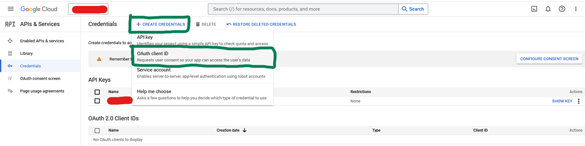
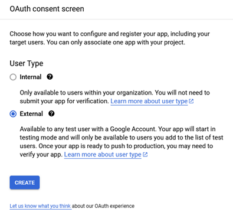
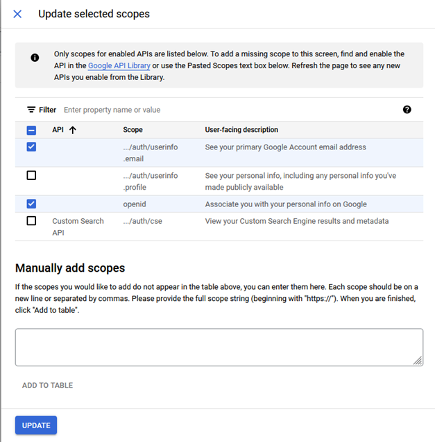
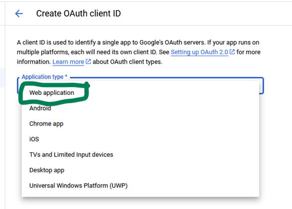
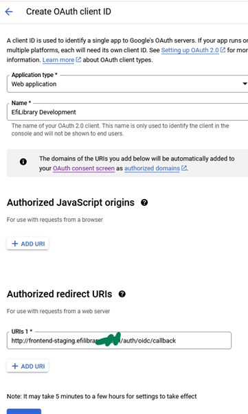
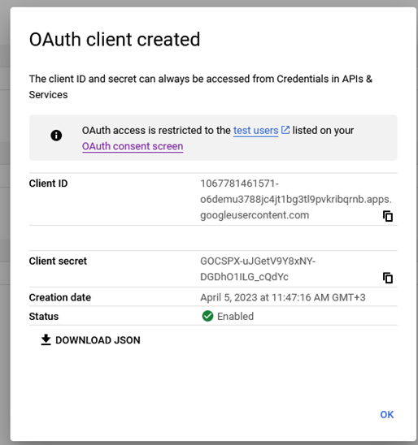

This is a guide for setting up the "Sign in with Google" button

Navigate to https://console.cloud.google.com/apis/credentials



Configure the consent screen

In this case it's `External` because this Google Cloud account is not linked to a Google Workspaces account



Update the scopes and set `openid` and `userinfo.email`









**Database setup**

Create an OIDC issuer entry with the following query:

```sql
INSERT INTO efilibrarydb.oidc_issuer
(oidc_issuer_id, issuer_name, oidc_well_known_url, oauth_client_id, oauth_client_secret, metadata)
VALUES (1, 'google', 'https://accounts.google.com/.well-known/openid-configuration',
        '1067781461571-o6demu3788jc4jt1bg3tl9pvkribqrnb.apps.googleusercontent.com',
        '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', '{}')
```

Please note: `oidc_issuer_id` number 1 is currently used for the authentication button on the login page.ö
