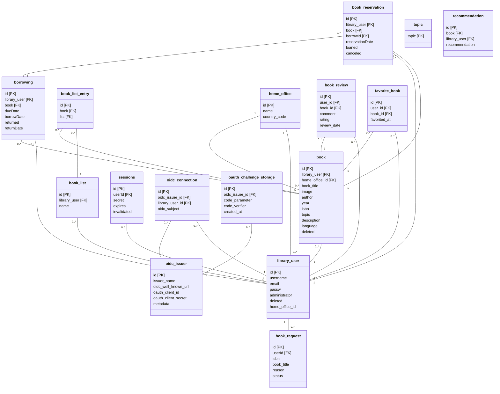

# Database Documentation

## Import Instructions

HeidiSQL installs with MariaDB automacially.
In HeidiSQL choose a session (new or existing) -> Advanced tab -> Startup script -> EfiLibrary1.sql file.

The sql file can be found in teams under database folder.

(Full table creation, inserting queries and table dropping queries are in the bottom of the document.)

## Relation Schema
Updated 27.11.2023



# Tables
Updated: 11.10.2023

##

### Name: book
Definition: A book that’s been registered to the library

| Properties       | Name              | Description                    | Type         | PK/FK/NOT NULL |
|------------------|-------------------|--------------------------------|--------------|-----------------|
|                  | id                |                                | Integer      | PK              |
|                  | library_user      | id of the user who owns the book | Integer      | FK              |
|                  | title             | Name of book                    | Varchar(250) | NOT NULL        |
|                  | image             | Url of the coverpicture                    | Varchar(500) |         |
|                  | author            | Name of author                  | Varchar(250) | NOT NULL        |
|                  | year             | Year published                    | Year | NOT NULL         |
|                  | isbn              | The book's ISBN                  | Varchar(20)  | NOT NULL        |
| not implemented                 | topic             | Books topic taken from Topic    | Varchar(50)  | FK              |
|                  | location          | Location of book                | Varchar(20)  | NOT NULL        |
|                  | deleted    | Determines if book has been deleted      | Bit(1)                          |              |

##

### Name: book_list
Definition: A list of books made by a user.

| Properties       | Name              | Description                    | Type         | PK/FK/NOT NULL |
|------------------|-------------------|--------------------------------|--------------|-----------------|
|                  | id                |                                | Integer      | PK              |
|                  | library_user      | id of the user that owns the list | Integer      | FK              |
|                  | name              | Name of the list                | Varchar(250)  |                 |

##

### Name: book_list_entry
Definition: Helper table that binds books to different lists.

| Properties       | Name              | Description                    | Type         | PK/FK/NOT NULL |
|------------------|-------------------|--------------------------------|--------------|-----------------|
|                  | id                |                                | Integer      | PK              |
|                  | book              | id of a book that is being binded | Integer      | FK              |
|                  | list              | id of a list the book is in | Integer      | FK              |

##

### Name: book_requests 
Definition: A request of a book made by a user.

| Properties       | Name              | Description                    | Type         | PK/FK/NOT NULL |
|------------------|-------------------|--------------------------------|--------------|-----------------|
|                  | id                |                                | Integer      | PK              |
|                  | library_user      | id of the user who is doing the request | Integer      | FK              |
|                  | isbn              | The book's ISBN                  | Varchar(20)  | NOT NULL        |
|                  | title             | Name of book                    | Varchar(250) | NOT NULL        |
|                  | reason             | Reason for requesting the book                  | Varchar(150) | NOT NULL        |
|                  | status    | Status of the request  | Integer       | NOT NULL        |

##

### Name: book_reservation 
Definition: A reservation of a book made by a user.

| Properties       | Name              | Description                    | Type         | PK/FK/NOT NULL |
|------------------|-------------------|--------------------------------|--------------|-----------------|
|                  | id                |                                | Integer      | PK              |
|                  | library_user      | id of the user who is doing the reserving | Integer      | FK              |
|                  | book              | id of book that is being reserved | Integer      | FK              |
|                  | borrow_id              | id of borrow card | Integer      | FK              |
|                  | reservationDate              | The beginning date of the reservation | Date         | NOT NULL        |
|  not implemented                | duration          | The duration of the reservation in days(?) | Integer      |                 |
|                  | loaned    | Is the book loaned or not  | Bit(1)       | NOT NULL        |
|                  | canceled    | Is the reservation canceled or not  | Bit(1)       | NOT NULL        |

##

### Name: book_reviews
Definition: User review and rating for books
| Properties       | Name                         | Description                     | Type         | PK/FK/NOT NULL  |
|------------------|------------------------------|---------------------------------|--------------|-----------------|
|                  | id                           |                                 | Integer      | PK              |
|                  | user_id                      | id of user that is reviewing    | Integer      | FK	             |
|                  | book_id                      | id of the reviewed book	    | Integer      | FK              |
|		   | comment		  	  | comment for a book review	    | TEXT	   | 		     |
|		   | rating			  | rating of the book		    | Integer	   |		     |
|		   | review_date		  | time when reviewd		    | Date	   | 		     |

##

### Name: borrowing
Definition: A borrow card that shows if a book is borrowed, by who, and until when.

| Properties       | Name              | Description                    | Type         | PK/FK/NOT NULL |
|------------------|-------------------|--------------------------------|--------------|-----------------|
|                  | id                |                                | Integer      | PK              |
|                  | library_user      | id of the user who is borrowing the book | Integer      | FK              |
|                  | book              | id of the book that’s being borrowed | Integer      | FK              |
|                  | dueDate           | Date of return                  | Date         | NOT NULL        |
|                  | borrowDate        | Date of borrow                  | Date         | NOT NULL        |
|                  | returned          | Is the borrow completed or not  | Bit(1)       | NOT NULL        |
|                  | returnDate        | Date of actual return           | Date         |        	  |

##

### Name: favorite_book
Definition: Offices and locations
| Properties       | Name                         | Description                     | Type         | PK/FK/NOT NULL  |
|------------------|------------------------------|---------------------------------|--------------|-----------------|
|                  | id                           |                                 | Integer      | PK              |
|                  | user_id                      | id of the user who favorited    | Integer      | FK	             |
|                  | book_id                      | id of book that is favorited    | Integer      | FK              |
|		   | favorited_at		  | time when favoritted 	    | Date	   | 		     |

##

### Name:	home_office 
Definition: Offices and locations
| Properties       | Name                         | Description                     | Type         | PK/FK/NOT NULL |
|------------------|------------------------------|---------------------------------|--------------|-----------------|
|                  | id                           |                                 | Integer      | PK              |
|                  | name                         | Name of the office              | Varchar(255)  | NOT NULL        |
|                  | country_code                 | country code of the location    | Varchar(3)  | NOT NULL        |

##

### Name:	library_user 
Definition: A user of the software
| Properties       | Name                         | Description                     | Type         | PK/FK/NOT NULL |
|------------------|------------------------------|---------------------------------|--------------|-----------------|
|                  | id                           |                                 | Integer      | PK              |
|                  | username                     | Username to log in              | Varchar(50)  | NOT NULL        |
|                  | email                     | User's email address               | Varchar(80)  | NOT NULL        |
| Type length depends on encryption | passw       | Password to log in           | Varchar(150) | NOT NULL        |
|                  | administrator    | Determines admin status      | Bit(1)                          |              |
|                  | deleted    | Determines if user has been deleted      | Bit(1)                          |              |

##

## not implemented

### Name: topic (not implemented)
Definition: Contains topics for books.

| Properties       | Name              | Description                    | Type         | PK/FK/NOT NULL |
|------------------|-------------------|--------------------------------|--------------|-----------------|
|                  | topic             | Topic names for books           | Varchar(50)  | PK              |

##

### Name: keyword (not implemented)
Definition: Table contains a list of keywords that books can be labeled with. Useful for keyword searches.

| Properties | Name    | Description                     | Type        | PK/FK/NOT NULL |
| ---------- | ------- | ------------------------------- | ----------- | -------------- |
|            | keyword | The keyword to label books with | Varchar(30) | PK             |

##

### Name: book_keyword (not implemented)
Definition: Helper table that binds keywords to books.

| Properties | Name    | Description                        | Type        | PK/FK/NOT NULL |
| ---------- | ------- | ---------------------------------- | ----------- | -------------- |
|            | id      |                                    | Integer     | PK             |
|            | book    | id of a book taken from Book table | Integer     | FK             |
|            | keyword | keyword taken from Keyword table   | Varchar(30) | FK             |

##

### Name: recommendation (not implemented)
Definition: A recommendation that is given to a book by a user.


| Properties | Name           | Description                                | Type    | PK/FK/NOT NULL |
| ---------- | -------------- | ------------------------------------------ | ------- | -------------- |
|            | id             |                                            | Integer | PK             |
|            | book           | id of the book that’s being rated          | Integer | FK             |
|            | library_user   | id of user who is doing the recommendation | Integer | FK             |
|            | recommendation | Is the book recommended or not             | Bit(1)  | NOT NULL       |

##

### CREATE TABLE Queries
Not updated

```sql
CREATE TABLE book (
  id INTEGER PRIMARY KEY,
  library_user INTEGER NOT NULL,
  topic VARCHAR(50) NOT NULL,
  title VARCHAR(250) NOT NULL,
  author VARCHAR(250) NOT NULL,
  isbn VARCHAR(20) NOT NULL,
  location VARCHAR(20) NOT NULL
);

CREATE TABLE library_user (
  id INTEGER PRIMARY KEY,
  username VARCHAR(50) NOT NULL,
  passw VARCHAR(150) NOT NULL,
  administrator BOOLEAN
);

ALTER TABLE library_user ADD CONSTRAINT UQ_libary_user_username UNIQUE(username);
ALTER TABLE book ADD CONSTRAINT FK_book_library_user FOREIGN KEY(library_user) REFERENCES library_user(id)
```

### INSERT INTO Queries

```sql
INSERT INTO library_user VALUES (
  1, "mikkomallikas", "1234", TRUE
);

INSERT INTO book VALUES (
  1, 1, "JS", "JS For Dummies", "JS Teacher", "12345-67-89", "MERICA"
);
```

### DROP TABLE Queries

```sql
DROP TABLE book;
DROP TABLE library_user;
```

```
